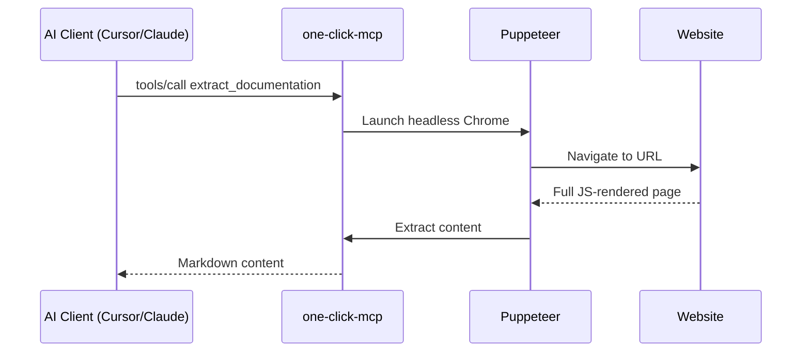

# MCP Integration

> [!NOTE]
> This MCP server is a **separate package** from the browser extension. Use the extension for quick manual extraction, use the MCP server for AI tool integration.

## Quick Start

The MCP server works with any MCP-compatible client via stdio transport.

### npx (No Installation)

```bash
npx one-click-mcp
```

### Local Development

```bash
cd mcp-server
npm install && npm run build
node dist/index.js
```

---

## Client Configuration

### Claude Desktop

Add to `~/.config/claude/claude_desktop_config.json`:

```json
{
  "mcpServers": {
    "one-click": {
      "command": "npx",
      "args": ["-y", "one-click-mcp"]
    }
  }
}
```

Or for local development:

```json
{
  "mcpServers": {
    "one-click": {
      "command": "node",
      "args": ["/absolute/path/to/one-click/mcp-server/dist/index.js"]
    }
  }
}
```

### Cursor

Add to `.cursor/mcp.json` in your project or `~/.cursor/mcp.json` globally:

```json
{
  "mcpServers": {
    "one-click": {
      "command": "npx",
      "args": ["-y", "one-click-mcp"]
    }
  }
}
```

### VSCode with Cline / Claude Dev

Add to your VSCode settings.json:

```json
{
  "cline.mcp.servers": {
    "one-click": {
      "command": "npx",
      "args": ["-y", "one-click-mcp"]
    }
  }
}
```

### Claude Code CLI

Add to `~/.config/codeium/config.json`:

```json
{
  "mcp_servers": {
    "one-click": {
      "command": "npx",
      "args": ["-y", "one-click-mcp"]
    }
  }
}
```

---

## Available Tools

### `extract_documentation`

Extracts documentation content from a URL as clean markdown.

| Argument | Type | Required | Description |
|----------|------|----------|-------------|
| `url` | string | Yes | The URL to extract |
| `waitTime` | number | No | Additional wait time in ms after page load |

**Example:**
```
Extract the documentation from https://react.dev/learn
```

### `list_documentation_sections`

Detects documentation sections from sidebar/navigation.

| Argument | Type | Required | Description |
|----------|------|----------|-------------|
| `url` | string | Yes | Any page on the documentation site |

**Example:**
```
List all sections available on https://docs.python.org/3/
```

### `extract_multiple_sections`

Batch extract multiple documentation pages at once.

| Argument | Type | Required | Description |
|----------|------|----------|-------------|
| `urls` | string[] | Yes | Array of URLs to extract |

---

## How It Works



The server uses Puppeteer (headless Chrome) to:
1. Navigate to the URL
2. Wait for network idle (no requests for 500ms)
3. Wait for JavaScript hydration
4. Extract main content, skipping nav/footer/ads
5. Convert to clean markdown

This handles SPAs, Docusaurus, VitePress, GitBook, and other JS-rendered documentation sites that simple HTTP fetch cannot handle.
