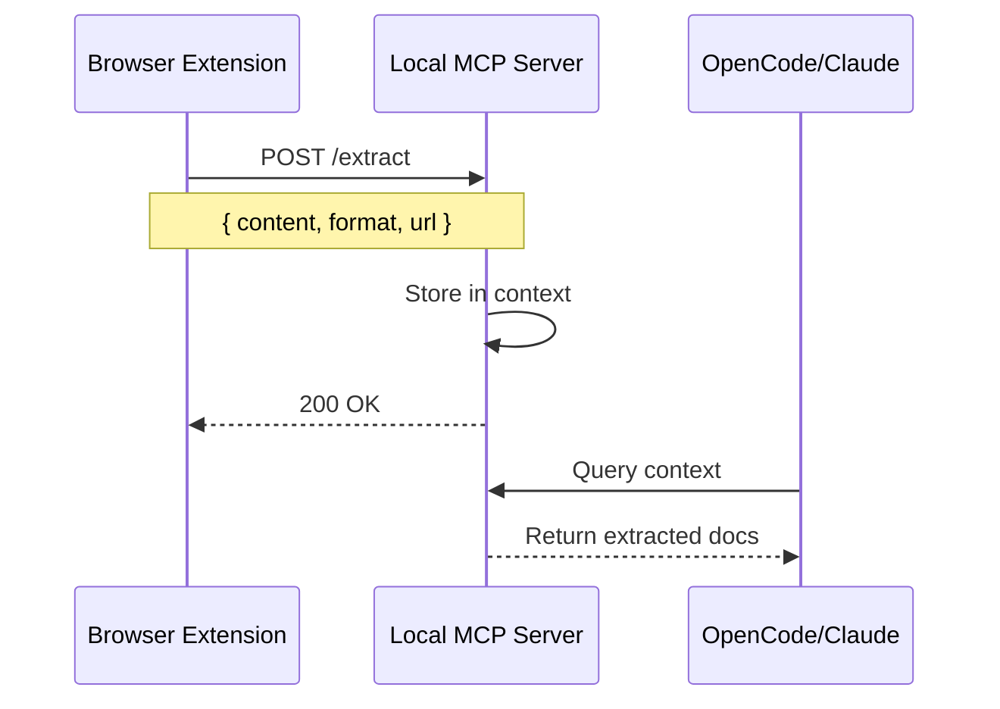

# MCP Integration - Future Reference

> [!NOTE]
> This is a reference document for Phase 2 implementation. Not part of MVP.

## Overview

Add a "Dev Mode" that sends extracted content directly to a local MCP server, enabling seamless integration with AI tools like OpenCode/Claude.

## Architecture



## Implementation Plan

### 1. Extension Side

Add settings panel with:
- Toggle: "Dev Mode" (off by default)
- Input: "MCP Server URL" (default: `http://localhost:3000`)
- Test connection button

When Dev Mode is enabled:
- Show additional "Send to AI" button
- POST content to configured endpoint

### 2. Local MCP Server

Create a simple Node.js server:

```typescript
// server.ts
import express from 'express';
import cors from 'cors';

const app = express();
app.use(cors());
app.use(express.json());

const contextStore: Map<string, ExtractedContent> = new Map();

app.post('/extract', (req, res) => {
  const { url, content, format, title } = req.body;
  const id = crypto.randomUUID();
  contextStore.set(id, { url, content, format, title, timestamp: Date.now() });
  res.json({ success: true, id });
});

app.get('/context', (req, res) => {
  res.json(Array.from(contextStore.values()));
});

app.get('/context/:id', (req, res) => {
  const content = contextStore.get(req.params.id);
  if (content) res.json(content);
  else res.status(404).json({ error: 'Not found' });
});

app.listen(3000, () => console.log('MCP bridge running on :3000'));
```

### 3. OpenCode Integration

Add to MCP config (`~/.config/opencode/config.json`):

```json
{
  "mcpServers": {
    "one-click-context": {
      "command": "node",
      "args": ["/path/to/one-click-mcp/server.js"]
    }
  }
}
```

## API Specification

### POST /extract

```json
{
  "url": "https://docs.example.com/page",
  "title": "Page Title",
  "format": "markdown",
  "content": "# Page Title\n\nExtracted content...",
  "sections": ["intro", "installation"],
  "extractedAt": "2026-01-08T19:00:00Z"
}
```

### GET /context

Returns all stored extractions for AI to query.

### GET /context/:id

Returns specific extraction by ID.

## Security Considerations

- Only runs on localhost
- No external network access
- Content stored in memory only (clears on restart)
- Optional: Add simple API key for extra security

## Resources

- [MCP Specification](https://modelcontextprotocol.io/)
- [Chrome Extension Native Messaging](https://developer.chrome.com/docs/extensions/develop/concepts/native-messaging)
